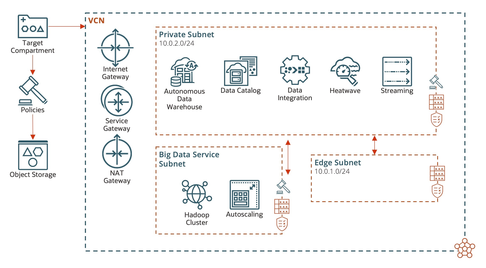

# oci-lakehouse
This is an [Oracle Resource Manager](https://docs.oracle.com/en-us/iaas/Content/ResourceManager/Concepts/resourcemanager.htm) stack built to assist deployment of each of the components in a [Data Lakehouse](https://www.oracle.com/data-lakehouse/) on Oracle Cloud Infrastructure.

# Deployment Architecture

The following diagram shows deployment architecture for this stack:

# Pre-Requisites

You should have administrative privileges when deploying this stack, as it includes IAM Group/Policy which is deployed to the tenancy root and requires relevant privileges to do so.

You should also ensure you have proper service limits for your tenancy prior to deployment or you will encounter errors.  Some first party services have default service limits of zero and require a capacity request to be increased.

# Deployment

Click the Deploy to OCI button here which will import the stack into your tenancy.

## VCN 

VCN creation is offered as part of this template, but you can also select a pre-existing VCN to deploy to.  When deploying a new VCN, options are included to customize CIDR ranges for included subnets.

## Autonomous Data Warehouse

Deployment options included are:

- Database name - The database name. The name must begin with an alphabetic character and can contain a maximum of 14 alphanumeric characters. Special characters are not permitted. The database name must be unique in the tenancy.
- Admin password - The password must be between 12 and 30 characters long, and must contain at least 1 uppercase, 1 lowercase, and 1 numeric character. It cannot contain the double quote symbol (") or the username "admin", regardless of casing. 
- CPU core count - The number of OCPU cores to be made available to the database. For Autonomous Databases on dedicated Exadata infrastructure, the maximum number of cores is determined by the infrastructure shape.
- Dedicated infrastructure - True if the database is on [dedicated Exadata infrastructure](https://docs.cloud.oracle.com/iaas/Content/Database/Concepts/adbddoverview.htm).
- Storage capacity - The size of the data volume that will be created and attached to the database. This storage can later be scaled up if needed. For Autonomous Databases on dedicated Exadata infrastructure, the maximum storage value is determined by the infrastructure shape. 
- Display name - The user-friendly name for the Autonomous Database. The name does not have to be unique.
- Preview version - If enabled, indicates that an Autonomous Database preview version is being provisioned, and that the preview version's terms of service have been accepted. Note that preview version software is only available for databases on [shared Exadata infrastructure](https://docs.cloud.oracle.com/iaas/Content/Database/Concepts/adboverview.htm#AEI).

## Big Data Service

Deployment options included are:

- Cluster admin password - Password for the cluster (and Cloudera Manager) admin user.
- SSH public key - The SSH public key used to authenticate the cluster connection.
- Display name -  Name of the Big Data Service cluster.
- BDS Version - Big Data Service version installed in the cluster.
- High availability - Whether or not High Availability (HA) is enabled - this affects cluster topology.
- Security - Whether or not the cluster should be setup as secure using Kerberos.
- Shape selection (master, utility, data) - Which OCI shapes should be used for each role.  See not below.
- Attached storage for each type of node - The size of storage volumes attached to each node (in GB).
- Autoscaling policy - Refer to [autoscaling provider documentation](https://registry.terraform.io/providers/hashicorp/oci/latest/docs/resources/bds_auto_scaling_configuration).

It is important to note that the *shape selection* filters against available shapes in the tenancy, *ensure you do not select an unsupported shape* or deployment will error.   Supported shapes are [documented here](https://www.oracle.com/big-data/big-data-service/).

## Data Catalog

Currently this creates a catalog which can be named.   Template enhancements are planned to support additional customization.

## Data Integration

Curently this creates a workspace which can be named and a description provided.   Template enhancements are planned to support additional customization.

## MySQL Heatwave

Deployment options included are:

- Admin username - The username for the administrative user.
- Admin password - The password for the administrative user. The password must be between 8 and 32 characters long, and must contain at least 1 numeric character, 1 lowercase character, 1 uppercase character, and 1 special (nonalphanumeric) character.
- Cluster shape selection - Select which shape should be used for the MySQL Heatwave cluster nodes.
- Cluster size - How many nodes should be deployed in the cluster.
- Data capacity - Initial size of the data volume in GBs that will be created and attached. Keep in mind that this only specifies the size of the database data volume, the log volume for the database will be scaled appropriately with its shape.
- Display name - The user-friendly name for the DB System. It does not have to be unique.
- Description -  User-provided data about the DB System.
- Hostname label - The hostname for the primary endpoint of the DB System. Used for DNS.  The value is the hostname portion of the primary private IP's fully qualified domain name (FQDN) (for example, "heatwave-1" in FQDN "heatwave-1.private.lakehousevcn.oraclevcn.com"). Must be unique across all VNICs in the subnet and comply with RFC 952 and RFC 1123.

## Streaming

Deployment options included are:

- Connect harness name - The name of the connect harness. Avoid entering confidential information. Example: JDBCConnector
- Stream name - The name of the stream. Avoid entering confidential information. Example: TelemetryEvents
- Partitions - The number of partitions in the stream.
- Stream pool name - The name of the stream pool. Avoid entering confidential information. Example: MyStreamPool
- Data retention policy - The retention period of the stream, in hours. Accepted values are between 24 and 168 (7 days).
- Topic auto-creation - Enable auto creation of topic on the server.
- Log retention policy - The number of hours to keep a log file before deleting it (in hours).
- Number of partitions - The default number of log partitions per topic.

